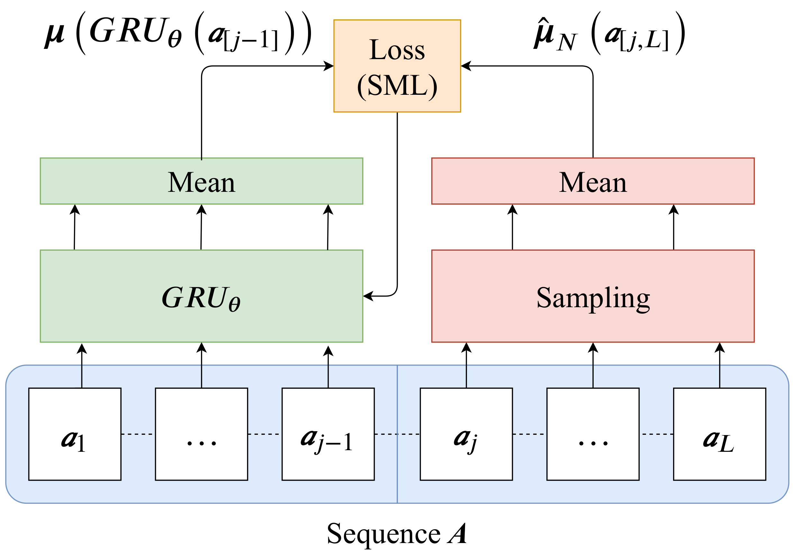

# Better, Faster, Stronger UIS-RNN

This repository implements some useful features on top of the original [UIS-RNN repository](https://github.com/google/uis-rnn). Some of them are described in the following paper: [Supervised Online Diarization with Sample Mean Loss for Multi-Domain Data](https://arxiv.org/abs/1911.01266).
Here is a list:
* **Sample Mean Loss (SML)**, a loss function that improves performance and training efficiency. To learn more about it you can read our paper.
* **Estimation of** `crp_alpha`, a parameter of the distance dependent Chinese Restaurant Process (ddCRP) that determines the probability of switching to a new speaker. Again, more info in our paper.
* **Parallel prediction** using `torch.multiprocessing`, that mitigates the issue with slow decoding and enables higher GPU usage.
* **Tensorboard** logging, for visualizing training.

Here is a diagram of the Sample Mean Loss:

<p align="center">
  
</p>

The UIS-RNN was originally proposed in [Fully Supervised Speaker Diarization](https://arxiv.org/abs/1810.04719).

<p align="center">
  
</p>

## Run the demo

To get started, simply run this command:

```bash
python3 demo.py --train_iteration=1000 -l=0.001
```

This will train a UIS-RNN model using `data/toy_training_data.npz`,
then store the model on disk, perform inference on `data/toy_testing_data.npz`,
print the inference results, and save the averaged accuracy in a text file.

P.S.: The files under `data/` are manually generated *toy data*,
for demonstration purpose only.
These data are very simple, so we are supposed to get 100% accuracy on the
testing data.

## Arguments

* `--loss_samples` the number of samples for the Sample Mean Loss. If `loss_samples <= 0` it will be ignored and the loss will be computed as per the original UIS-RNN
* `--fc_depth`: the numebr of fully connected layers after the GRU.
* `--non_lin`: whether to use non linearity (relu) in the fully connected layers.

All the other arguments are the same as per the [original repository](https://github.com/google/uis-rnn)

## Citations

Our paper is cited as:

```
coming soon
```
